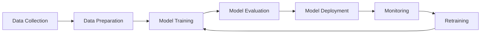

# 🔄 MLOps Best Practices

## Overview
Comprehensive guide to Machine Learning Operations (MLOps) - the practice of deploying and maintaining ML models in production reliably and efficiently.

## 🎯 What is MLOps?

### Core Principles
- **Automation**: CI/CD for ML pipelines
- **Versioning**: Code, data, and model versioning
- **Monitoring**: Performance and drift detection
- **Reproducibility**: Consistent results across environments
- **Collaboration**: Cross-functional team workflows
- **Governance**: Compliance and audit trails

### MLOps Lifecycle


## 🛠️ Essential Tools & Platforms

### Experiment Tracking
```python
# MLflow Example
import mlflow
import mlflow.sklearn
from sklearn.ensemble import RandomForestClassifier

# Start MLflow run
with mlflow.start_run():
    # Log parameters
    mlflow.log_param("n_estimators", 100)
    mlflow.log_param("max_depth", 10)
    
    # Train model
    model = RandomForestClassifier(n_estimators=100, max_depth=10)
    model.fit(X_train, y_train)
    
    # Log metrics
    accuracy = model.score(X_test, y_test)
    mlflow.log_metric("accuracy", accuracy)
    
    # Log model
    mlflow.sklearn.log_model(model, "random_forest_model")
```

### Data Versioning
```bash
# DVC (Data Version Control)
# Initialize DVC
dvc init

# Add data to DVC
dvc add data/raw/dataset.csv

# Track changes
git add data/raw/dataset.csv.dvc .gitignore
git commit -m "Add raw dataset"

# Push to remote storage
dvc remote add -d myremote s3://mybucket/dvcstore
dvc push
```

### Pipeline Orchestration
```python
# Apache Airflow DAG
from airflow import DAG
from airflow.operators.python_operator import PythonOperator
from datetime import datetime, timedelta

default_args = {
    'owner': 'data-team',
    'depends_on_past': False,
    'start_date': datetime(2024, 1, 1),
    'email_on_failure': True,
    'email_on_retry': False,
    'retries': 1,
    'retry_delay': timedelta(minutes=5)
}

dag = DAG(
    'ml_training_pipeline',
    default_args=default_args,
    description='ML model training pipeline',
    schedule_interval=timedelta(days=1)
)

# Define tasks
def preprocess_data(**context):
    # Data preprocessing logic
    pass

def train_model(**context):
    # Model training logic
    pass

def evaluate_model(**context):
    # Model evaluation logic
    pass

def deploy_model(**context):
    # Model deployment logic
    pass

# Create tasks
t1 = PythonOperator(
    task_id='preprocess_data',
    python_callable=preprocess_data,
    dag=dag
)

t2 = PythonOperator(
    task_id='train_model',
    python_callable=train_model,
    dag=dag
)

t3 = PythonOperator(
    task_id='evaluate_model',
    python_callable=evaluate_model,
    dag=dag
)

t4 = PythonOperator(
    task_id='deploy_model',
    python_callable=deploy_model,
    dag=dag
)

# Set dependencies
t1 >> t2 >> t3 >> t4
```

## 🚀 CI/CD for ML

### GitHub Actions Workflow
```yaml
name: ML Pipeline

on:
  push:
    branches: [ main ]
  pull_request:
    branches: [ main ]

jobs:
  test:
    runs-on: ubuntu-latest
    steps:
    - uses: actions/checkout@v2
    
    - name: Set up Python
      uses: actions/setup-python@v2
      with:
        python-version: 3.9
    
    - name: Install dependencies
      run: |
        pip install -r requirements.txt
        pip install pytest flake8
    
    - name: Lint code
      run: flake8 src/
    
    - name: Run tests
      run: pytest tests/
    
    - name: Train model
      run: python src/train.py
    
    - name: Evaluate model
      run: python src/evaluate.py
      
    - name: Upload model artifacts
      uses: actions/upload-artifact@v2
      with:
        name: model-artifacts
        path: models/
```

### Model Registry
```python
# MLflow Model Registry
from mlflow.tracking import MlflowClient

client = MlflowClient()

# Register model
model_uri = "runs:/{}/model".format(run_id)
registered_model = client.create_registered_model("production_model")

# Create model version
model_version = client.create_model_version(
    name="production_model",
    source=model_uri,
    run_id=run_id
)

# Transition to production
client.transition_model_version_stage(
    name="production_model",
    version=model_version.version,
    stage="Production"
)
```

## 📊 Model Monitoring

### Performance Monitoring
```python
# Model performance monitoring
import numpy as np
from prometheus_client import Counter, Histogram, Gauge

# Define metrics
prediction_counter = Counter('model_predictions_total', 
                           'Total number of predictions')
prediction_latency = Histogram('model_prediction_duration_seconds',
                             'Prediction latency')
model_accuracy = Gauge('model_accuracy', 'Current model accuracy')

class ModelMonitor:
    def __init__(self, model):
        self.model = model
        self.predictions = []
        self.actuals = []
        
    @prediction_latency.time()
    def predict(self, X):
        prediction = self.model.predict(X)
        prediction_counter.inc()
        self.predictions.extend(prediction)
        return prediction
    
    def update_actuals(self, y_true):
        self.actuals.extend(y_true)
        self._calculate_metrics()
    
    def _calculate_metrics(self):
        if len(self.predictions) == len(self.actuals):
            accuracy = np.mean(
                np.array(self.predictions) == np.array(self.actuals)
            )
            model_accuracy.set(accuracy)
```

### Data Drift Detection
```python
# Evidently AI for drift detection
from evidently.dashboard import Dashboard
from evidently.tabs import DataDriftTab

# Create drift report
drift_dashboard = Dashboard(tabs=[DataDriftTab()])
drift_dashboard.calculate(
    reference_data=reference_df,
    current_data=current_df,
    column_mapping=column_mapping
)

# Save report
drift_dashboard.save("reports/drift_report.html")

# Automated drift detection
def check_data_drift(reference_data, current_data, threshold=0.5):
    from scipy.stats import ks_2samp
    
    drift_detected = False
    drift_features = []
    
    for column in reference_data.columns:
        if reference_data[column].dtype in ['float64', 'int64']:
            statistic, p_value = ks_2samp(
                reference_data[column],
                current_data[column]
            )
            
            if p_value < threshold:
                drift_detected = True
                drift_features.append(column)
    
    return drift_detected, drift_features
```

## 🏗️ Infrastructure as Code

### Terraform for ML Infrastructure
```hcl
# main.tf
provider "aws" {
  region = "us-west-2"
}

# S3 bucket for model artifacts
resource "aws_s3_bucket" "model_artifacts" {
  bucket = "ml-model-artifacts"
  acl    = "private"
  
  versioning {
    enabled = true
  }
  
  lifecycle_rule {
    enabled = true
    
    transition {
      days          = 30
      storage_class = "STANDARD_IA"
    }
  }
}

# SageMaker execution role
resource "aws_iam_role" "sagemaker_role" {
  name = "sagemaker-execution-role"
  
  assume_role_policy = jsonencode({
    Version = "2012-10-17"
    Statement = [
      {
        Action = "sts:AssumeRole"
        Effect = "Allow"
        Principal = {
          Service = "sagemaker.amazonaws.com"
        }
      }
    ]
  })
}

# SageMaker notebook instance
resource "aws_sagemaker_notebook_instance" "ml_notebook" {
  name                    = "ml-development-notebook"
  instance_type          = "ml.t3.medium"
  role_arn              = aws_iam_role.sagemaker_role.arn
  default_code_repository = "https://github.com/your-org/ml-notebooks.git"
}
```

### Kubernetes Deployment
```yaml
# ml-deployment.yaml
apiVersion: apps/v1
kind: Deployment
metadata:
  name: ml-model-serving
spec:
  replicas: 3
  selector:
    matchLabels:
      app: ml-model
  template:
    metadata:
      labels:
        app: ml-model
    spec:
      containers:
      - name: model-server
        image: your-registry/ml-model:latest
        ports:
        - containerPort: 8080
        resources:
          requests:
            memory: "2Gi"
            cpu: "1"
          limits:
            memory: "4Gi"
            cpu: "2"
        env:
        - name: MODEL_PATH
          value: "/models/latest"
        livenessProbe:
          httpGet:
            path: /health
            port: 8080
          initialDelaySeconds: 30
          periodSeconds: 10
---
apiVersion: v1
kind: Service
metadata:
  name: ml-model-service
spec:
  selector:
    app: ml-model
  ports:
  - port: 80
    targetPort: 8080
  type: LoadBalancer
```

## 💡 Best Practices

### 1. Version Control Everything
```python
# config/model_config.yaml
model:
  name: "customer_churn_classifier"
  version: "1.2.0"
  framework: "sklearn"
  algorithm: "random_forest"
  
hyperparameters:
  n_estimators: 100
  max_depth: 10
  min_samples_split: 5
  
preprocessing:
  scaling: "standard"
  encoding: "one_hot"
  
training:
  test_size: 0.2
  random_state: 42
  cross_validation: 5
```

### 2. Automated Testing
```python
# tests/test_model.py
import pytest
import numpy as np
from src.model import ChurnClassifier

class TestChurnClassifier:
    def test_model_prediction_shape(self):
        model = ChurnClassifier()
        X = np.random.rand(10, 5)
        predictions = model.predict(X)
        assert predictions.shape == (10,)
    
    def test_model_probability_range(self):
        model = ChurnClassifier()
        X = np.random.rand(10, 5)
        probabilities = model.predict_proba(X)
        assert np.all(probabilities >= 0) and np.all(probabilities <= 1)
    
    def test_model_performance_threshold(self):
        model = ChurnClassifier()
        X_test, y_test = load_test_data()
        accuracy = model.score(X_test, y_test)
        assert accuracy > 0.85  # Performance threshold
```

### 3. Feature Store
```python
# Feature store implementation
from feast import FeatureStore

# Initialize feature store
fs = FeatureStore(repo_path="feature_repo/")

# Define features
customer_features = fs.get_online_features(
    features=[
        "customer_stats:total_purchases",
        "customer_stats:days_since_last_purchase",
        "customer_stats:average_purchase_value"
    ],
    entity_rows=[{"customer_id": 123}]
).to_dict()

# Use features for prediction
model_input = prepare_features(customer_features)
prediction = model.predict(model_input)
```

## 📈 Metrics & KPIs

### Technical Metrics
- **Model Performance**: Accuracy, precision, recall, F1
- **Latency**: P50, P95, P99 response times
- **Throughput**: Requests per second
- **Error Rate**: Failed predictions percentage
- **Resource Utilization**: CPU, memory, GPU usage

### Business Metrics
- **Model ROI**: Revenue impact vs. cost
- **Prediction Value**: Business value per prediction
- **Time to Deploy**: From development to production
- **Model Refresh Rate**: Retraining frequency
- **Incident Rate**: Production issues per month

## 🔗 MLOps Stack

### Popular Tool Combinations
1. **Startup Stack**:
   - MLflow + DVC + GitHub Actions + Heroku

2. **Enterprise Stack**:
   - Kubeflow + Seldon + Prometheus + Grafana

3. **Cloud-Native Stack**:
   - SageMaker + Step Functions + CloudWatch

4. **Open Source Stack**:
   - Airflow + MLflow + MinIO + Kubernetes

## 🎓 Learning Resources

### Courses & Certifications
- **Google Cloud ML Engineer**: Professional certification
- **AWS ML Specialty**: AWS certification
- **MLOps Specialization**: Coursera
- **Full Stack Deep Learning**: Berkeley course

### Books & Guides
- "Introducing MLOps" by O'Reilly
- "Building Machine Learning Pipelines" 
- "Practical MLOps" by Noah Gift
- "Machine Learning Design Patterns"

---

*Building reliable, scalable, and maintainable machine learning systems in production* 🔄🚀